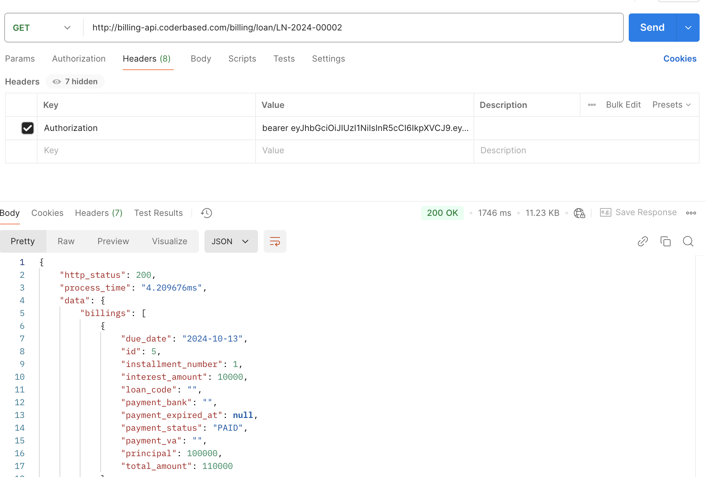

## Introduction

This project primarily follows a clean architecture pattern and uses a home-made framework called GRST—a combination of REST-API and gRPC. 

Our Framework: https://github.com/herryg91/cdd.

## How to Run

Requires: go v1.21 (we recommend v1.23)

```
go mod tidy && go run main.go

// notes: Don't forget to set up the environment variables
```

**Run using Docker**

```
docker-compose up

// notes: Update the docker-compose.yml to change the environment variable before run the docker-compose
```

## Project Structure

This is the flow to understand the code:

**Contract -> Handler -> UseCase -> Repository**

  

To help understand the project, here’s a quick overview of its main components:

1. **Contract**: Located in the `/contract` folder 
This contains the API contracts written in Protobuf, providing a clear and structured API definition.
2. **Handler**: Located in the `/handler` folder 
This component implements the definitions in the contract using the GRPC framework.
3. **UseCase**: Located in the `/app/usecase` folder
This is where the core business logic is implemented.
4. **Repository**: Located in the `/app/repository` folder
This component handles data access, typically for database interactions.
5. **Entity**: Located in the `/app/entity` folder
This defines the objects used in both the use cases and repositories.
6. **GRST folder**: Located in `/handler/grst`
This folder contains code generated by `cdd` and `protoc-gen-cdd`, which are part of our framework: https://github.com/herryg91/cdd. Setting this up can be tricky, so this folder has been committed to GitHub for convenience.

## Database & Migrations

We are using PostgreSQL as the database. Migration files are located in the `/migrations` folder. There are several ways to done this:

1. Set `RUN_MIGRATION` into `true` in envar config. `Golang's Goose` will handle the migrations out of the box

2. Set `RUN_MIGRATION` into `false`, then run manually the sql scripts on the migrations folder.

## Environment Variable

Environment variables can be found in the /config folder and overridden in the .env file.

- **REST_PORT**: Sets the port on which the REST API will run
- **GRPC_PORT**: Sets the port on which gRPC will run
- **DB_HOST**, **DB_PORT**, and other **DB_** prefixed variables: Configure your database connection settings here.
- **AUTH_TOKEN_SECRET**: Used to generate JWT tokens for session management.
- **REFRESH_TOKEN_SECRET**: Used for generating JWT refresh tokens.
- **PASSWORD_SALT**: Salt used for JWT token creation. Changing this will affect user table seeding.
- **FLAT_INTEREST_RATE**: Configures the annual flat rate, used in loan simulations and in generating loan and billing schedules.
- **RUN_MIGRATION**: if set into TRUE will run the migrations using embedded [Goose](https://github.com/pressly/goose) everytime the application run

## Authentication & Auth Token

Some of the endpoints that has this statement `option (cdd.api.auth) = { needauth: true };` in the **contract** need an Authentication token set in the header which can be set like this:

```
Authorization: bearer {auth token}

```
  

To generate the auth token, there are two ways:
- **Login Endpoint**: Send a POST request to `{host}/user/login`. Detailed information can be found in `/contract/auth.proto`.
- **gRPC Method**: Call the GenerateToken method via gRPC. Detailed information can be found in `/contract/usertoken.proto`.

Postman Example:



## Create New User

Run create-user script in `cmd/create-user`. This script requires 3 args:
1. --email or -e
2. --password or -p
3. --name or -n

```
./create-user -e admin@billing.com -p password123 -n admin

```

Notes: don't forget to set the environment variable (database, etc)